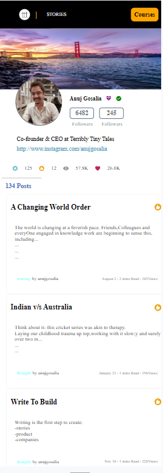
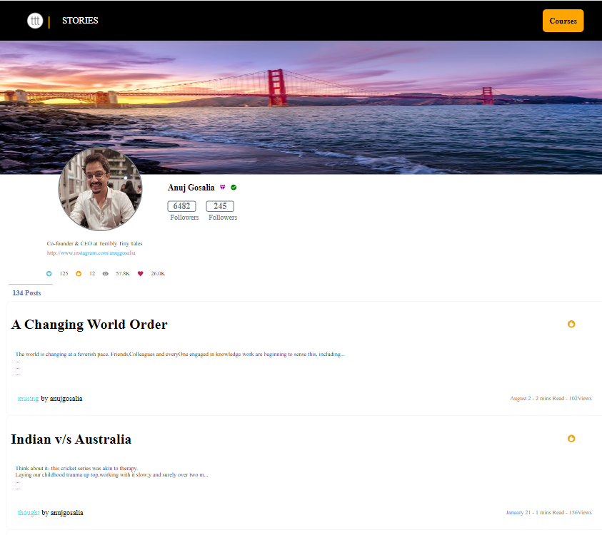

# Assignment Title : 📛

### Profile Screen

# Live Link: 🔗

[(ctrl+link)] (https://profile-screen-assignment.vercel.app/)

# About the assignment 📚

This is a React application for a profile screen that showcases a user's profile along with associated posts. The project includes various components such as NavBar, Post, Icon, and Profile, each contributing to the overall functionality and appearance of the profile screen.
# Screenshots: 📷

# Technologies Used: ⚛️

1. **React (⚛️):**

   - The core technology for building the user interface and managing the state of your application.

2. **Material-UI:**

   - A React UI framework that provides pre-built components and styles. I am using icons from the `@mui/icons-material` package, which is part of the Material-UI ecosystem.

3. **npm:**
   - npm (Node Package Manager) is used for installing and managing JavaScript packages, including React and Material-UI.

# Setup / Installation: 💻

- Clone the repository: git clone <repository_url>
- Install dependencies: npm install
- Run the application: npm run dev

# Libraries/Plugins Used:

### 1. React:

- A JavaScript library for building user interfaces.

### 2. Material-UI:

- A popular React UI framework that provides a set of high-quality React components.

### 3. @mui/icons-material:

- Material-UI icons library providing a set of pre-built icons.

# Folder Structure:

### Components:

- Contains individual React components (NavBar, Icon, Post, Profile).

### data.json:

- JSON file containing sample post data.

### App.css, icon.css, NavBar.css, Post.css, Profile.css:

- Stylesheets for respective components.

### App.jsx:

- Main entry point for the application.

### README.md:

- Documentation file for the GitHub repository.

 # Components
### 1. App Component
- Imports NavBar, Profile, Icon, Post, and data.
Composes these components to create the overall structure of the profile screen.
### 2. Icon Component
- Displays icons (e.g., stars, recommendations, views, favorites) with corresponding counts.
### 3. NavBar Component
- Presents a navigation bar with a logo and 'STORIES' section.
### 4. Post Component
- Maps through the data array to generate individual post components.
- Each post includes a heading, body, and footer.
### 5. Profile Component
- Renders the user's profile information, including a header image, profile picture, user details, and social links.
# Styling
- The styling is done using CSS files associated with each component.
- Icons from the Material-UI library are used to enhance the visual appeal.

 # Credits
- Icons are sourced from the Material-UI library.
- Sample data for posts is stored in the data.json file.
